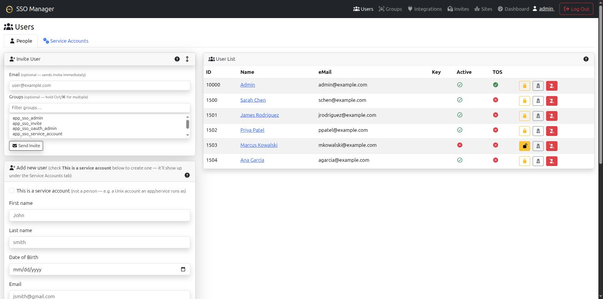
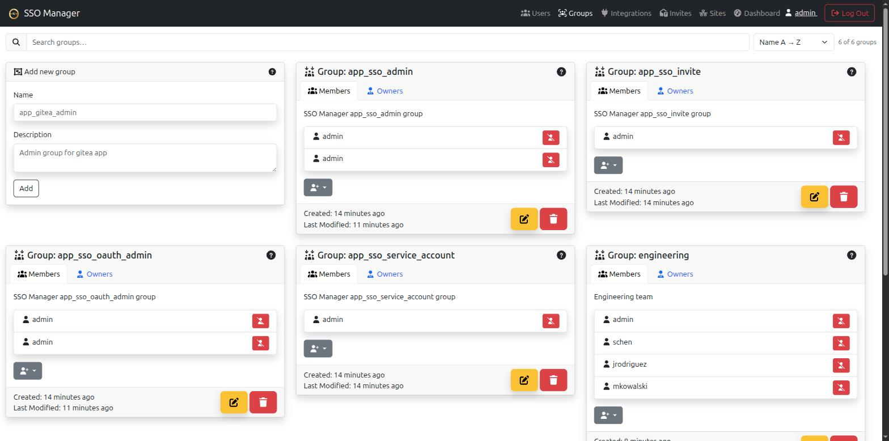
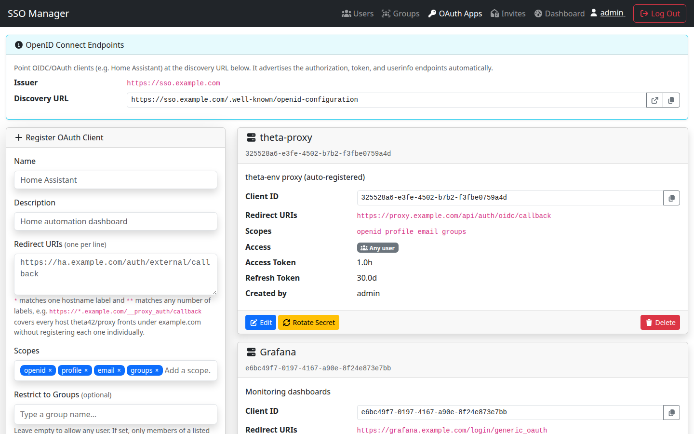

# SSO Manager

A self-hosted **OpenID Connect provider** with a bundled **OpenLDAP directory**
and a web management UI — for home labs and small businesses that want their own
identity provider instead of a hosted one.

It gives you one place to manage your users and groups, one login (OIDC) that
your modern apps can use, and one LDAP directory your older or odder apps can
bind to directly. Everything runs on your own hardware; there is no
phone-home, no hosted control plane, and no per-user pricing.

> Setting up the whole stack (this SSO + the [theta42/proxy](https://github.com/theta42/proxy)
> in front of it) with one command? Skip to [theta-env](https://github.com/theta42/theta-env)
> — its `setup.sh` wires the two together and generates the config for you.

**Documentation:** [https://theta42.github.io/sso-manager-node/](https://theta42.github.io/sso-manager-node/)

## Screenshots

| Dashboard | Users |
| --- | --- |
| [](docs/images/dashboard.png) | [](docs/images/users.png) |

| Groups | OAuth Apps |
| --- | --- |
| [](docs/images/groups.png) | [](docs/images/oauth-clients.png) |

## Features

- **OpenID Connect / OAuth 2.0 provider** — issue your own access, refresh, and
  ID tokens; protect your apps with standard OIDC login. Discovery document at
  `/.well-known/openid-configuration`.
- **Bundled OpenLDAP directory** — users, groups, POSIX accounts
  (`posixAccount`/`inetOrgPerson`), SSH public keys, and sudo roles, with
  `memberOf` + referential-integrity overlays. This is your single source of
  truth for identity, not a sidecar.
- **Web management UI** — manage users, groups, and OAuth clients from a
  browser; invite and password-reset flows over email; user self-service for
  profile and API tokens.
- **LDAPS for legacy apps** — apps that bind LDAP directly (Gitea, Emby, and
  anything else that speaks LDAP) use LDAPS (636) or StartTLS against the same
  directory, so you don't maintain a second user database for them.
- **Personal access tokens** — any user can mint a long-lived bearer token to
  drive the management API from scripts or CI, scoped to their own permissions.
- **All-in-one Docker image** — app + OpenLDAP + Redis in one container, or run
  the pieces separately against your own LDAP/Redis via `app_*` env config.
- **Multi-Site Support (Geo-Location Scaling)** — built-in support for N-Way Multi-Master OpenLDAP replication across physical sites for HA and low latency.

## Why this over the alternatives

Tools like Keycloak, Authentik, Authelia, or Zitadel are OIDC providers, but
LDAP is either a paid feature, a federation target you have to run separately,
or absent. If your stack already has apps that speak LDAP directly (or you just
want one real directory as the source of truth), you end up running *two*
identity systems and keeping them in sync.

SSO Manager bundles the OpenLDAP directory with the OIDC provider, so OIDC
apps and LDAP apps read from the same users and groups. The trade-off is
scope: it is intentionally small and self-hosted, not an enterprise IAM suite
— no fancy workflow engine, no hosted SaaS. If you want a lightweight,
self-contained identity provider with a real LDAP backend, that is the niche.

## Quick start

Three ways to run it, in order of how much it sets up for you:

### 1. As part of the unified stack (recommended)

[theta-env](https://github.com/theta42/theta-env) composes this SSO Manager with
the [theta42/proxy](https://github.com/theta42/proxy) (an OIDC-protected reverse
proxy) and generates all the config from a single `setup.env` — you enter your
domain once and it fills in the LDAP DNs, hostnames, OAuth issuer, and random
secrets consistently:

```bash
git clone --recursive https://github.com/theta42/theta-env.git
cd theta-env
cp setup.env.example setup.env   # set CFG_DOMAIN to your domain
./setup.sh                       # generates ./config/, builds + bootstraps + starts both
```

See the [theta-env README](https://github.com/theta42/theta-env) for the full
first-run flow, DNS/port requirements, and backups.

### 2. Standalone, in Docker

The all-in-one image bundles the app, OpenLDAP, and Redis. Copy the example
secrets file, fill in your values, and build:

```bash
git clone https://github.com/theta42/sso-manager-node.git
cd sso-manager-node
mkdir -p config && chmod 700 config
cp secrets.js.example config/sso-secrets.js
$EDITOR config/sso-secrets.js     # set ldap.bindPassword, oauth.jwtSecret, ...
docker compose up -d --build
```

The web UI comes up at `http://localhost:3001`. To kick the tires with no
config file at all, the entrypoint falls back to safe defaults
(`dc=example,dc=com`, admin password `admin`, an auto-generated JWT) — fine for
a local test, not for production.

Your domain is entered once, as the LDAP base DN (`stack.ldapBaseDn`); the other
LDAP DNs and the OAuth issuer derive from it and must stay consistent. See
[DEPLOYMENT.md](DEPLOYMENT.md) for the full config reference, the `app_*` env
vars, LDAPS/TLS, and backups.

### 3. Bare metal on Debian/Ubuntu

An automated installer installs Node.js, Redis, and (on first run) OpenLDAP —
configuring the directory (modules, overlays, schema, the SSO groups) and
seeding `/etc/sso-manager/secrets.js` with a generated admin password and JWT
secret — then deploys the app to `/opt/theta42/sso-manager` and starts a
systemd service:

```bash
wget -O - https://raw.githubusercontent.com/theta42/sso-manager-node/master/install.sh | sudo bash
```

That's it — LDAP and the app are both live afterward. Edit
`/etc/sso-manager/secrets.js` (org name, SMTP, a non-default base DN, ...) and
restart the service to customize. It's idempotent and safe to re-run —
re-running it updates the app in place (never touching LDAP or the secrets
file again) and prints the version you're updating from and to (e.g. `Updated
v1.1.13 -> v1.1.14`), or `Already up to date` if there's nothing new. Full
details, including env var overrides (`LDAP_BASE_DN`, `SKIP_LDAP`, ...), in
[DEPLOYMENT.md](DEPLOYMENT.md) under *Method 2: Bare metal*.

## Architecture

```
┌─────────────┐
│  Browser /  │
│  OIDC apps  │
└──────┬──────┘
       │ HTTP/HTTPS
       ▼
┌────────────────────────┐      ┌─────────────┐
│  Express SSO Manager   │◄────►│   Redis     │
│  - OIDC provider       │      │ - sessions  │
│  - web UI (:3001)      │      │ - models    │
│  - management API      │      └─────────────┘
└────────┬───────────────┘
         │ ldapi/ldap (localhost)
         ▼
┌────────────────────────┐
│  OpenLDAP (slapd)      │
│  - users / groups      │
│  - LDAPS :636          │─── legacy apps bind directly
│  - StartTLS :389       │
└────────────────────────┘
```

## Documentation

The nitty LDAP details (overlay setup, the custom `theta42Person` schema, the
required groups, LDAPS/TLS, direct-bind service accounts) live in:

- [DEPLOYMENT.md](DEPLOYMENT.md) — Docker + bare metal, the config layers, the
  `app_*` env reference, LDAPS/TLS, backups, troubleshooting.
- [API.md](API.md) — the management API.
- [docs/](docs/) (GitHub Pages) — the same content broken into
  [deployment](docs/deployment.md), [configuration](docs/configuration.md),
  [OAuth/OIDC](docs/oauth.md), and [LDAP](docs/ldap.md).
- [CHANGELOG.md](CHANGELOG.md) — what changed in each release.
- All of the above is also readable from the running app itself at `/docs` —
  no internet access required.

If you are pointing the app at your own existing LDAP server, see
*LDAP requirements* in [DEPLOYMENT.md](DEPLOYMENT.md) — the directory needs the
`pw-sha2`, `ppolicy`, `memberof`, and `refint` modules plus a small custom
schema. The bundled Docker image and `install.sh` set all of that up for you.
Required groups: `app_sso_admin` (full admin), `app_sso_oauth_admin` (manage
OAuth clients only), `app_sso_invite` (invitation management) — see
DEPLOYMENT.md for the full setup.

## Development

```bash
cd nodejs
npm install
npm run dev      # nodemon auto-reload
npm test         # jest test suite
```

## License

MIT — see [LICENSE](LICENSE).
